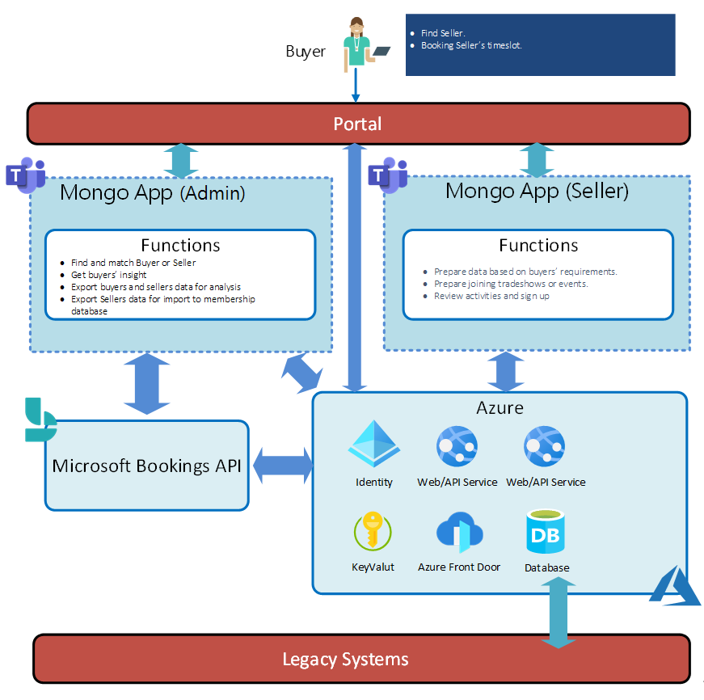

## Solution Overview

Refer the following image for architecture.

The **Mongo-App** has the following main components:
* **Buyer**
  * Find Seller and booking Seller's timeslot.
* **MongoApp(Admin)**
  * Find and match Buyer or Seller.
  * Get buyer's insight.
  * Export buyers and sellers data for analysis.
  * Export Sellers data for import to membership database.
* **MongoApp(Seller)**
  * Prepare database on buyer's requirements.
  * Prepare joining tradeshows or events.
  * Review activities and sign up.

---

## The API used by the APP
API Name | Method | Endpoint
--- | --- | --- 
Create bookingBusiness | POST | [https://graph.microsoft.com/v1.0/solutions/bookingBusinesses](https://graph.microsoft.com/v1.0/solutions/bookingBusinesses)
Delete bookingBusiness | DELETE | [https://graph.microsoft.com/v1.0/solutions/bookingBusinesses/{bookingsID}](https://graph.microsoft.com/v1.0/solutions/bookingBusinesses)
Publish bookingBusiness | POST | [https://graph.microsoft.com/v1.0/solutions/bookingBusinesses/{bookingsID}/publish](https://graph.microsoft.com/v1.0/solutions/bookingBusinesses/{bookingsID}/publish)
Create bookingStaffMember | POST | [https://graph.microsoft.com/beta/bookingBusinesses/{bookingsID}/staffMembers](https://graph.microsoft.com/beta/bookingBusinesses/{bookingsID}/staffMembers)
Create bookingService | POST | [https://graph.microsoft.com/beta/bookingBusinesses/{bookingsID}/calendarView](https://graph.microsoft.com/beta/bookingBusinesses/{bookingsID}/calendarView)
Delete bookingService | POST | [https://graph.microsoft.com/v1.0/solutions/bookingBusinesses/{bookingsID}/publish](https://graph.microsoft.com/v1.0/solutions/bookingBusinesses/{bookingsID}/publish)
List customers | POST | [https://graph.microsoft.com/beta/bookingBusinesses/{bookingsID}/staffMembers](https://graph.microsoft.com/beta/bookingBusinesses/{bookingsID}/staffMembers)
List business calendarView | POST | [https://graph.microsoft.com/beta/bookingBusinesses/{bookingsID}/calendarView](https://graph.microsoft.com/beta/bookingBusinesses/{bookingsID}/calendarView)
